<h1 align="center">Lingli</h1>

<p align="center">
  A multi-end community care and neighborhood service system powered by HarmonyOS, Vue, FastAPI, and AI-assisted workflows.
</p>

<p align="center">
  <a href="./README.md">简体中文</a> ｜ <a href="./README_EN.md">English</a>
</p>

<p align="center">
  <a href="https://github.com/XXYoLoong/Lingli"></a>
  
  
  
  
  
</p>

<p align="center">
  <a href="https://harmonycare.cn">Live Site</a> ｜ <a href="https://www.bilibili.com/video/BV1PNdaBvE5y/">Web Demo</a> ｜ <a href="https://www.bilibili.com/video/BV194daBJE3z/">HarmonyOS Demo</a>
</p>

## Overview

Lingli is a full-stack software project for community care, neighborhood services, and elderly-friendly service coordination. It covers resident service requests, worker check-in, order dispatching, AI-assisted review, notifications, user management, dashboard analytics, and HarmonyOS device interaction capabilities.

The system contains three major parts:

| Module | Stack | Description |
| --- | --- | --- |
| HarmonyOS App | ArkTS / ArkUI / HarmonyOS NEXT | Resident service requests, worker check-in, service result submission, grasp-aware navigation, knock and air-gesture sharing |
| Web Console | Vue 3 / TypeScript / Element Plus / ECharts | Management console, order center, dispatch center, AI review, user management, settings |
| Backend Service | FastAPI / SQLAlchemy / Alembic / SQLite | Authentication, orders, dispatch, stations, messages, analytics, AI review, user APIs |

## Highlights

1. Resident service requests for repair, cleaning, meal assistance, hospital escort, errands, and care services.
2. Worker mobile workflow with order context, location check-in, service code scanning, camera capture, and result submission.
3. Web-based operational console for order tracking, dispatching, users, settings, and service analytics.
4. AI-assisted review for service records and exception handling.
5. HarmonyOS interaction features including grasp-aware floating navigation and device-to-device sharing.
6. Multi-role access control for residents, workers, station managers, dispatchers, operators, and administrators.
7. Deployable engineering layout with backend migrations, frontend build scripts, and mobile app modules.

## Screenshots

### Web Console

| Dashboard | Order Center |
| --- | --- |
| 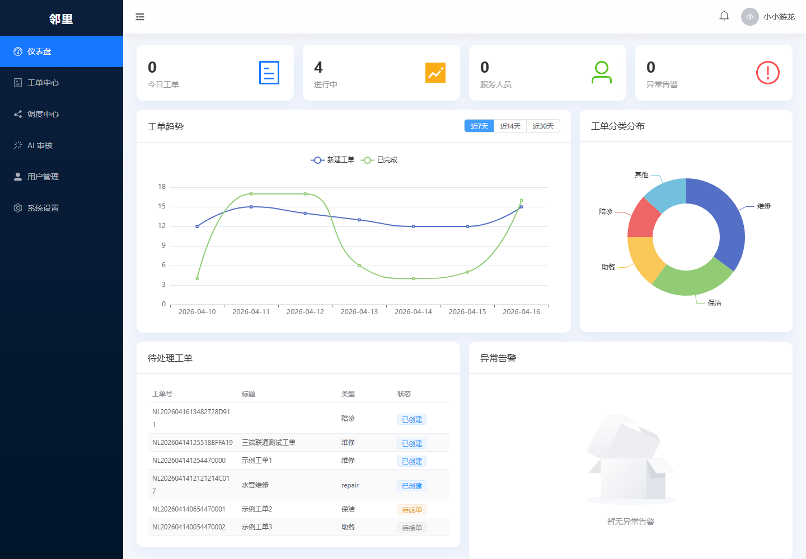 | 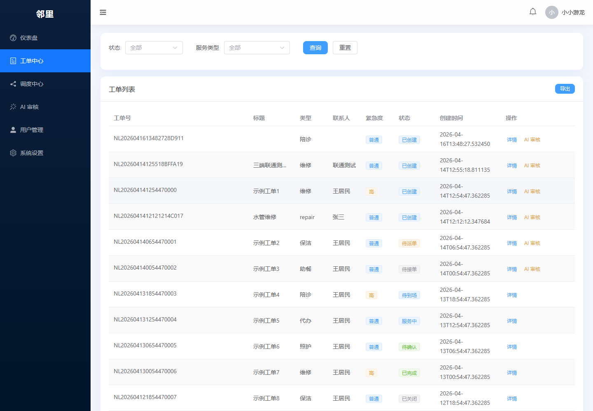 |

| Dispatch Center | AI Review |
| --- | --- |
| 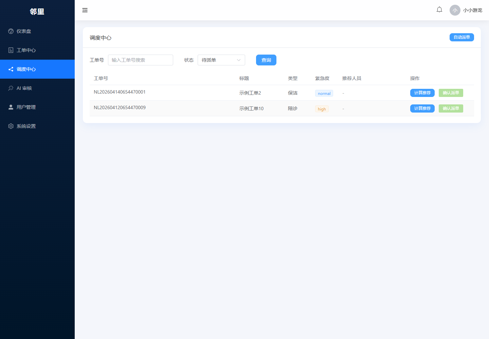 | 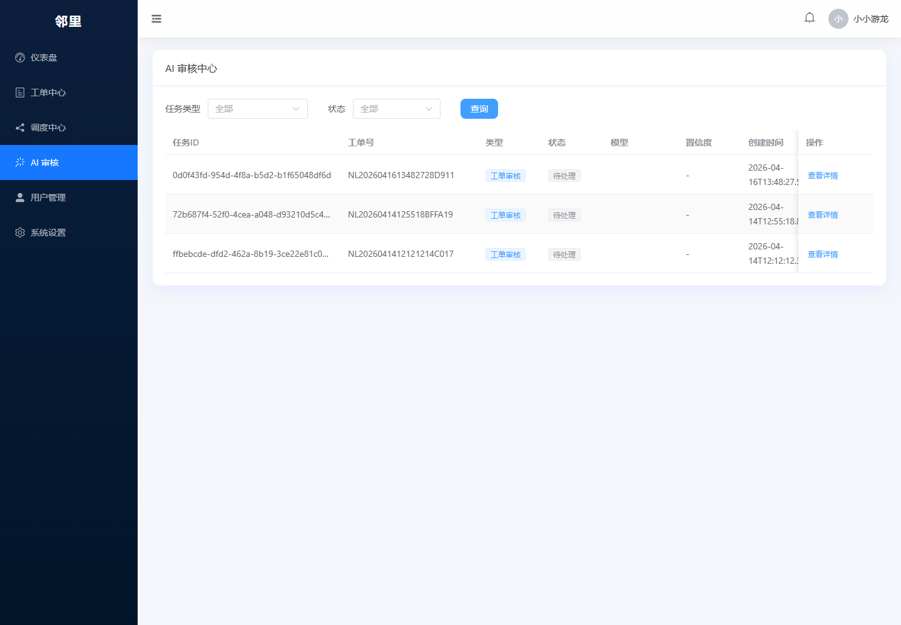 |

| User Management | Settings |
| --- | --- |
| 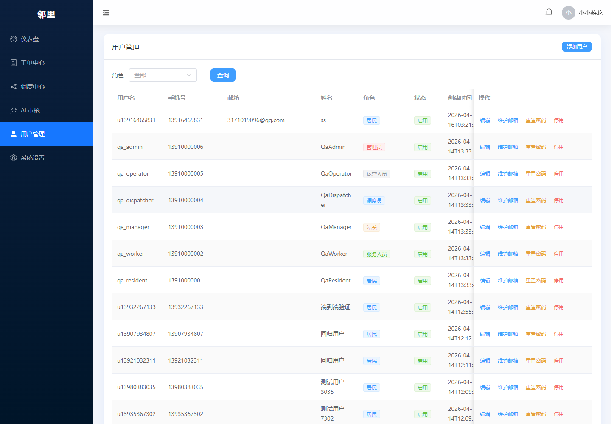 | 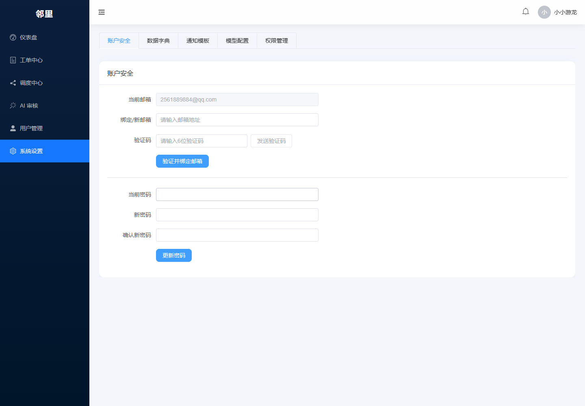 |

### HarmonyOS App

| Home | Service Request | Check-in / Result |
| --- | --- | --- |
| 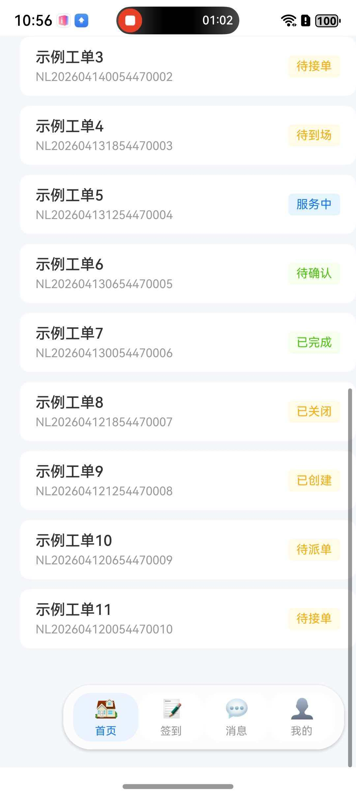 | 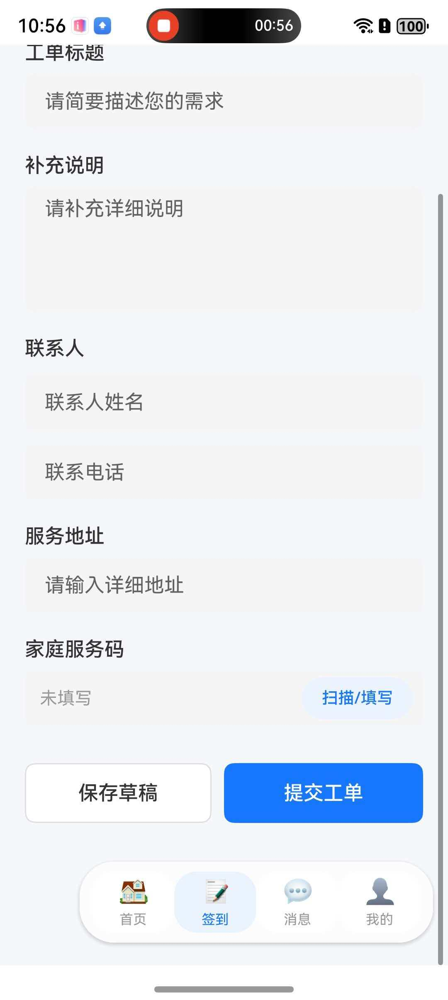 | 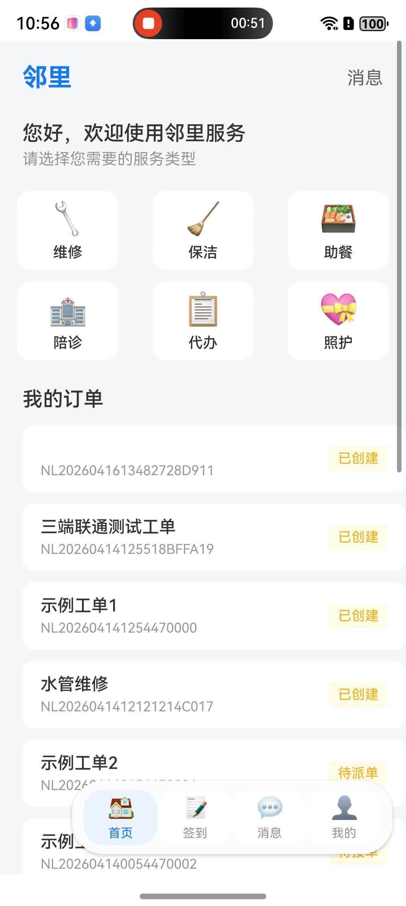 |

| Messages / Profile | Device Interaction | Workflow |
| --- | --- | --- |
| 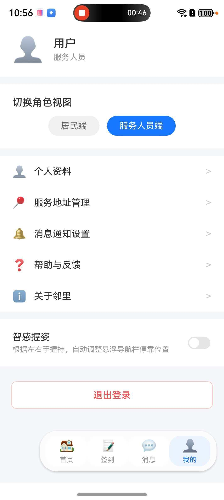 | 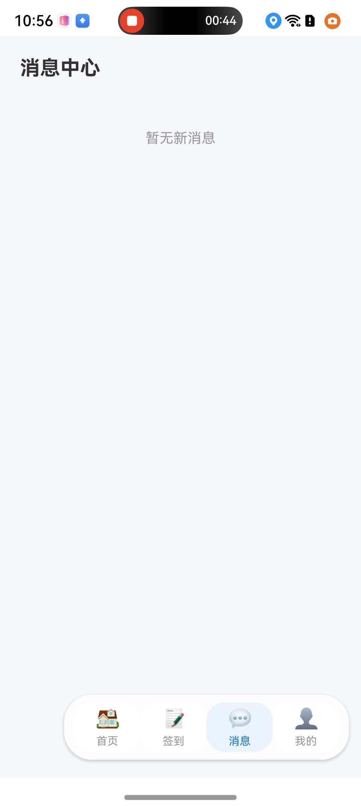 | 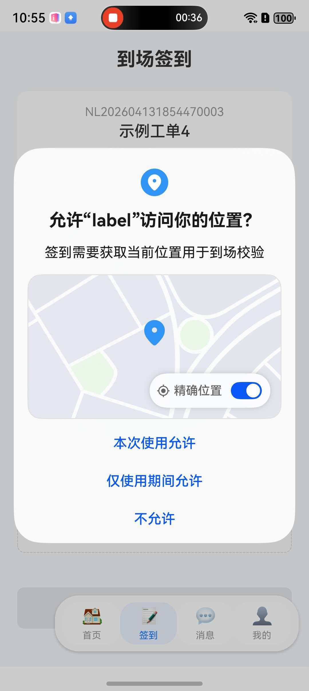 |

| Service Detail | Page Interaction | Result Feedback |
| --- | --- | --- |
| 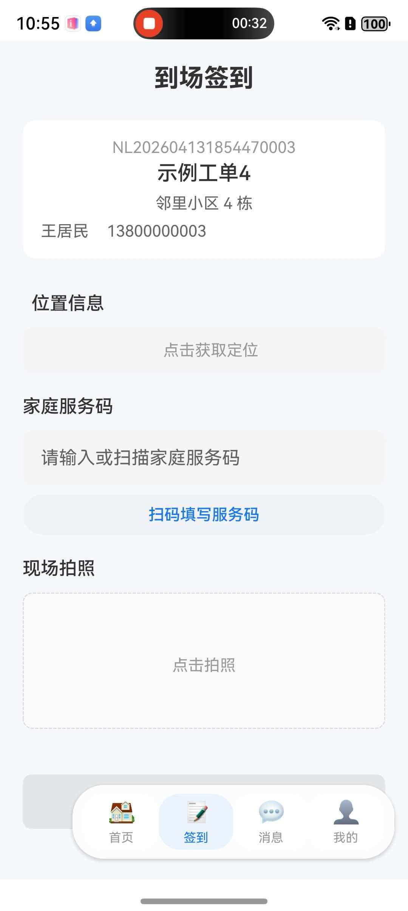 | 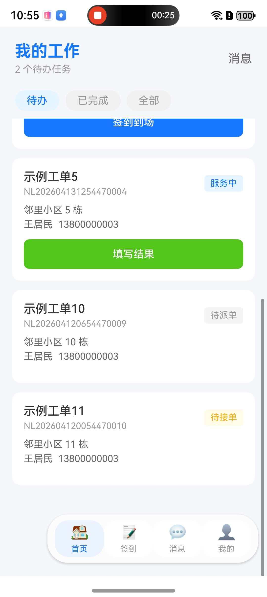 | 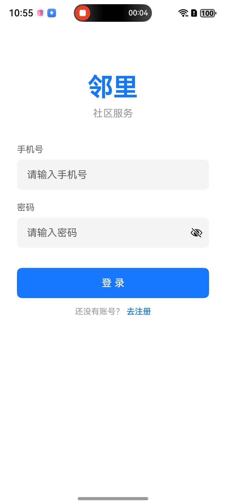 |

## Demo Videos

| Title | Link |
| --- | --- |
| Lingli HarmonyOS Real-device Demo | https://www.bilibili.com/video/BV194daBJE3z/ |
| ElderSmart+ Integrated Real-device Demo | https://www.bilibili.com/video/BV1U6deBEEWy/ |
| Lingli Software Demo | https://www.bilibili.com/video/BV1AMdaBYEFL/ |
| Smart Education Agent System Based on Rehabilitation Therapy | https://www.bilibili.com/video/BV1FVdaBFESb/ |
| Lingli Community Management System Web Console | https://www.bilibili.com/video/BV1PNdaBvE5y/ |

## Repository Layout

```text
Lingli/
├── Backend/                 # FastAPI backend service
│   ├── app/api/             # REST API routers
│   ├── app/models/          # SQLAlchemy models
│   ├── app/schemas/         # Pydantic schemas
│   ├── app/services/        # Business services
│   └── alembic/             # Database migrations
├── Frontend/                # Vue 3 management console
│   └── src/
├── Lingli/                  # HarmonyOS ArkTS application
│   └── entry/src/main/ets/
├── docs/images/             # README screenshots
├── tools/                   # Deployment and utility scripts
└── docker-compose.yml
```

## Quick Start

### Backend

```bash
cd Backend
python -m venv venv
venv\Scripts\activate
pip install -r requirements.txt
uvicorn app.main:app --reload --host 0.0.0.0 --port 8000
```

### Web Console

```bash
cd Frontend
npm install
npm run dev
```

### HarmonyOS App

Open `Lingli/` with DevEco Studio 6 and build the `entry@default` module. A command-line build can be launched with:

```powershell
& "F:\DevEco Studio 6.0.0\tools\node\node.exe" "F:\DevEco Studio 6.0.0\tools\hvigor\bin\hvigorw.js" --mode module -p module=entry@default -p product=default -p requiredDeviceType=phone assembleHap --analyze=normal --parallel --incremental --daemon
```

## API Modules

| Module | Path | Description |
| --- | --- | --- |
| Auth | `/api/v1/auth` | Registration, login, user identity |
| Orders | `/api/v1/orders` | Service requests, check-in, completion, queries |
| Dispatch | `/api/v1/dispatch` | Candidate calculation and order dispatching |
| Messages | `/api/v1/messages` | Message list, unread count, read status |
| Stats | `/api/v1/stats` | Dashboard metrics and trends |
| Stations | `/api/v1/stations` | Community service station management |
| AI | `/api/v1/ai` | AI review tasks and results |
| Users | `/api/v1/users` | User list, roles, administration |

## Technology Stack

| Area | Technologies |
| --- | --- |
| Mobile | HarmonyOS NEXT, ArkTS, ArkUI, ShareKit, MultimodalAwarenessKit |
| Frontend | Vue 3, TypeScript, Vite, Pinia, Vue Router, Element Plus, ECharts |
| Backend | FastAPI, SQLAlchemy, Alembic, Pydantic, SQLite |
| AI | Alibaba Tongyi / Qwen API |
| Deployment | Docker Compose, PowerShell, Shell scripts |

## License

This project is licensed under the Apache License 2.0. See [LICENSE](./LICENSE) for details.

## Maintainer

**Yoloong (倪家诚)** focuses on **HarmonyOS / ArkUI application development, AI capability integration, full-stack web engineering, and agent-oriented system building**. His work spans the full implementation path of a software project, including **product-facing UI development, backend services, API integration, deployment, and iterative delivery**. Current projects mainly center on **smart healthcare, intelligent interaction, productivity tools, and scenario-driven software systems**. More work and ongoing projects can be found at **[yoloong.com](https://yoloong.com)** and **[harmonycare.cn](https://harmonycare.cn)**.

**游龙（倪家诚）**，持续从事 **HarmonyOS / ArkUI 应用开发、AI 能力集成、Web 全栈工程实现与智能体系统构建**。项目实践覆盖软件落地的完整链路，包括 **面向产品的界面开发、后端服务实现、接口集成、部署上线与持续迭代**。当前工作主要围绕 **智慧健康、智能交互、效率工具与场景化软件系统** 展开。更多项目与持续更新内容见 **[yoloong.com](https://yoloong.com)** 与 **[harmonycare.cn](https://harmonycare.cn)**。
